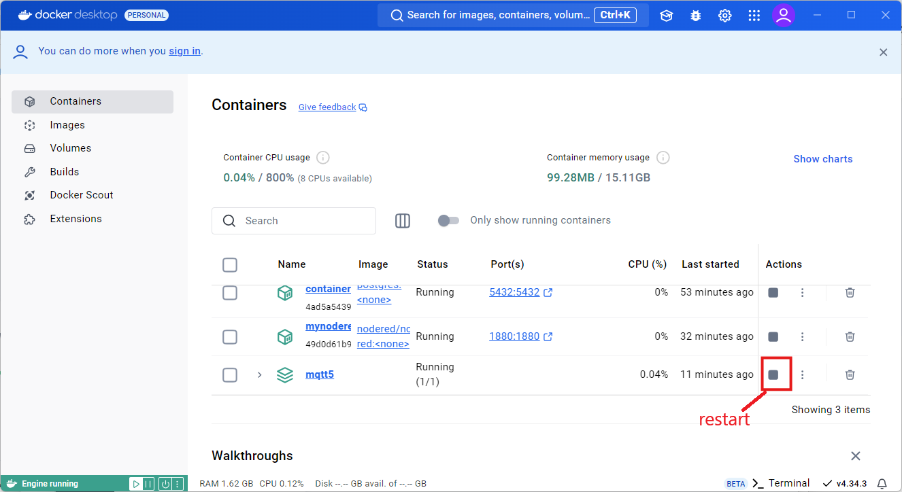

# install mqtt5 Container

## 1 Create base folder for mqtt config
```
mkdir mqtt5

cd mqtt5

# for storing mosquitto.conf and pwfile (for password)
mkdir config
mkdir data
mkdir log
```

## 2 Create Mosquitto config file - mosquitto.conf
```
code  config/mosquitto.conf
```
Basic Configuration file  content below including websocket config

```
allow_anonymous false
listener 1883
listener 9001
protocol websockets
persistence true
password_file /mosquitto/config/pwfile
persistence_file mosquitto.db
persistence_location /mosquitto/data/
```

## 3  Create Mosquitto password file - pwfile
```
code config/pwfile
```
- just openwile and save Blank File

## 4 Create docker-compose file called 'docker-compose.yml'
```
services:
  # mqtt5 eclipse-mosquitto
  mqtt5:
    image: eclipse-mosquitto
    container_name: mqtt5
    ports:
      - "1883:1883" #default mqtt port
      - "9001:9001" #default mqtt port for websockets
    volumes:
      - ./config:/mosquitto/config:rw
      - ./data:/mosquitto/data:rw
      - ./log:/mosquitto/log:rw
    restart: unless-stopped

# volumes for mapping data,config and log
volumes:
  config:
  data:
  log:

networks:
  default:
    name: mqtt5-network
```
 
## 5 Run docker compose up -d  inside folder mqtt5
```
mqtt5> docker compose up -d
mqtt5> docker compose ps
```


## 6 Create a user/password in the pwfile
```
# login interactively into the mqtt container
docker compose exec mqtt5 sh

# Create new password file and add user and it will prompt for password (user1/password)
mosquitto_passwd -c /mosquitto/config/pwfile user1

# Add additional users (remove the -c option) and it will prompt for password  (user1/password)
mosquitto_passwd /mosquitto/config/pwfile user2

# delete user command format
mosquitto_passwd -D /mosquitto/config/pwfile <user-name-to-delete>

# type 'exit' to exit out of docker container prompt
```


# install mqttx

goto [https://mqttx.app/](https://mqttx.app/)


download Desktop x86-64


## Restart container




## Create Connnection with mqttx


