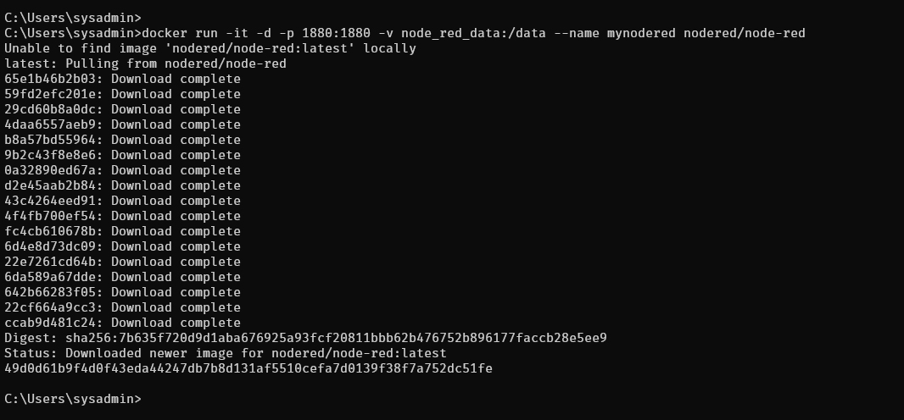
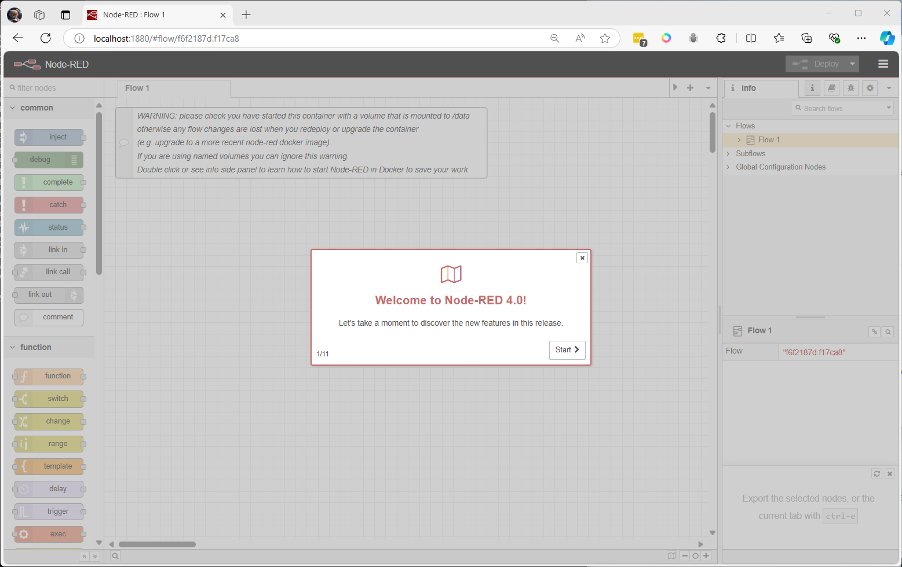
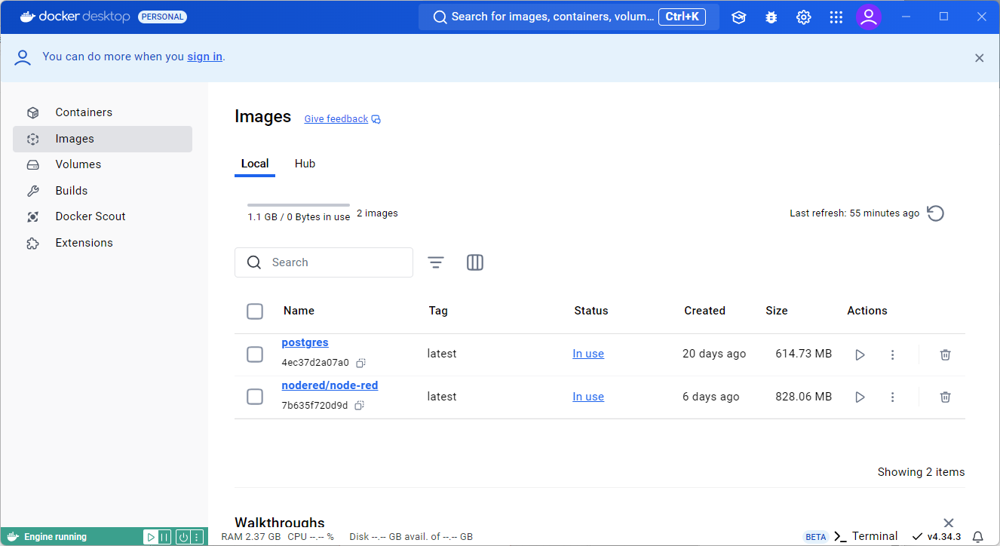
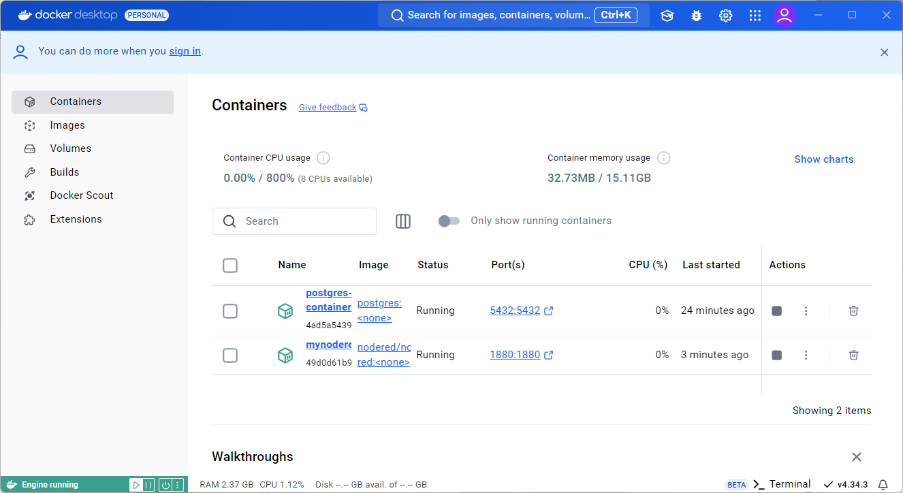

# install nodered Container

```
docker run -it -d -p 1880:1880 -v node_red_data:/data --name mynodered nodered/node-red
```




Open browser  http://localhost:1880


Check in Docker Desktop





