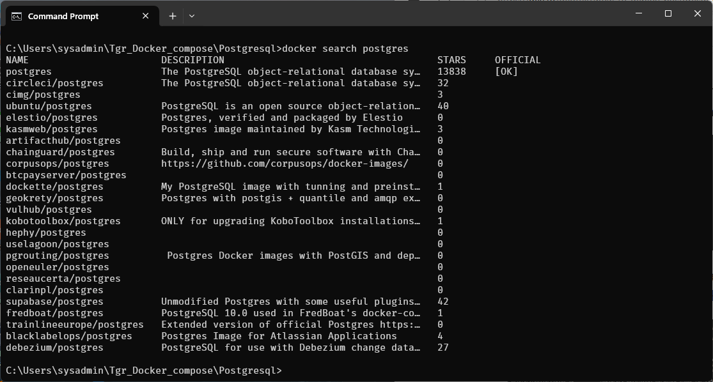

# install  Postgresql Container

**Create folder**
- Open windows terminal create 2 Folder
    - Tgr_Docker_compose
    - Postgresql
```
mkdir Tgr_Docker_compose
cd Tgr_Docker_compose
mkdir Postgresql
cd Postgresql
```

**Search command**
```
docker search postgresql
```



**Pull image**
```
docker pull postgres:latest
```


**Show image**
```
docker images
```


**Docker run**
```
docker run --name postgres-container -e POSTGRES_USER=root -e POSTGRES_PASSWORD=secret -p 5432:5432 -d postgres
```


## Please Read Explanation and remember it: 

The command you provided will run a PostgreSQL container using Docker. Here's a breakdown of the command:

- **docker run**: The command to create and run a new container.
- **--name postgres-container**: This names the container as "postgres-container".
- **-e POSTGRES_USER=root**: This sets the environment variable POSTGRES_USER to "root" inside the container.
- **-e POSTGRES_PASSWORD=secret**: This sets the environment variable POSTGRES_PASSWORD to "secret", allowing you to log in with the user "root".
- **-p 5432:5432**: This maps port 5432 on your local machine (host) to port 5432 on the container, allowing you to access the PostgreSQL server on localhost:5432.
- **-d**: This runs the container in detached mode (in the background).
- **postgres**: This is the image name, meaning it will pull and run the official PostgreSQL image from Docker Hub.
Once the container is running, you can connect to the PostgreSQL database on localhost:5432 using the username "root" and password "secret".
---------------  
Show images:


Show Containers:


**Summary Docker command**

| Command       | Objective      |
| ------------- | -------------- |
| docker search | search image online |
| docker pull `<image name>`  | Pull image name postgresql |
| docker pull postgresql:latest  | Pull image name postgresql |
| docker run --name postgres-container -e POSTGRES_USER=root -e POSTGRES_PASSWORD=secret -p 5432:5432 -d postgres | Docker Run |

**Download DBeaver Community**
[https://dbeaver.io/download/](https://dbeaver.io/download/)


Download windows version and install 


## Open Dbeaver Application


