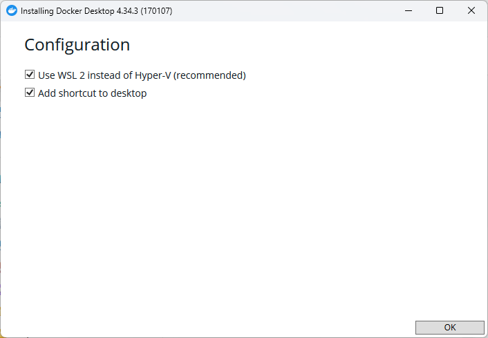
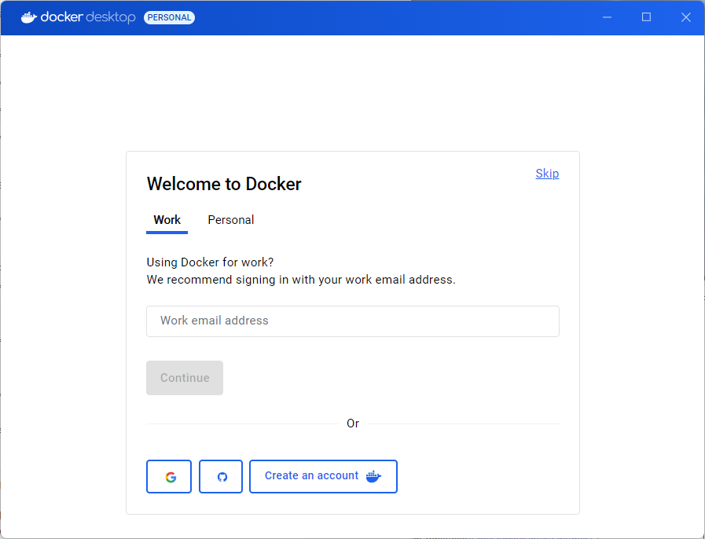
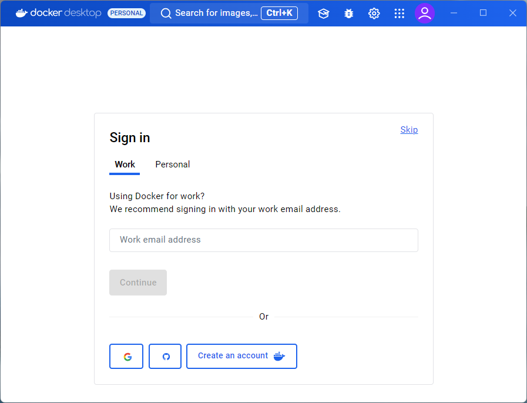
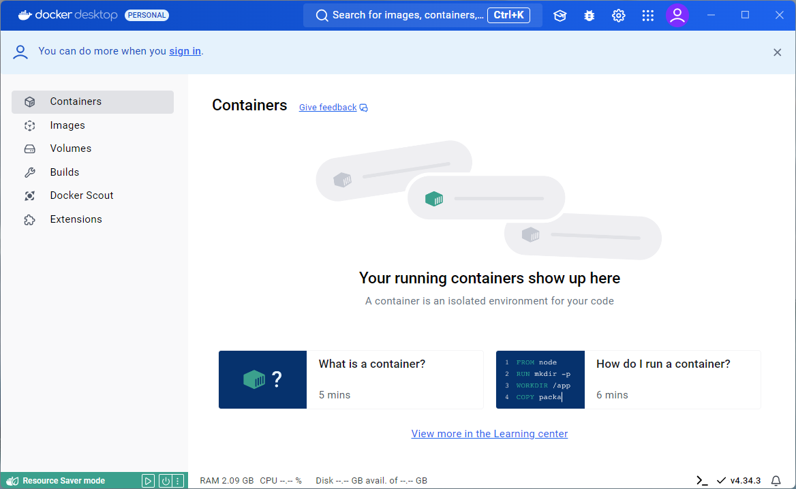
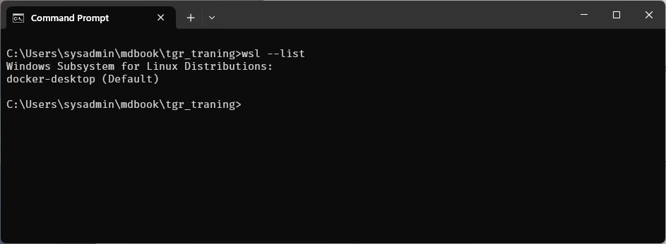
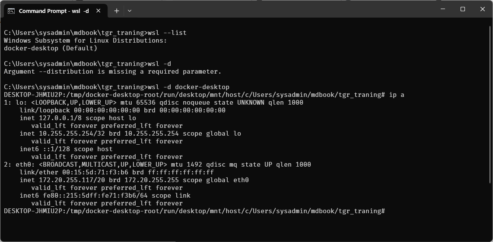
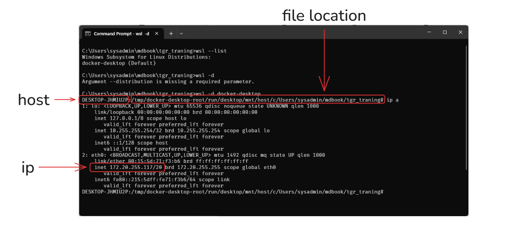
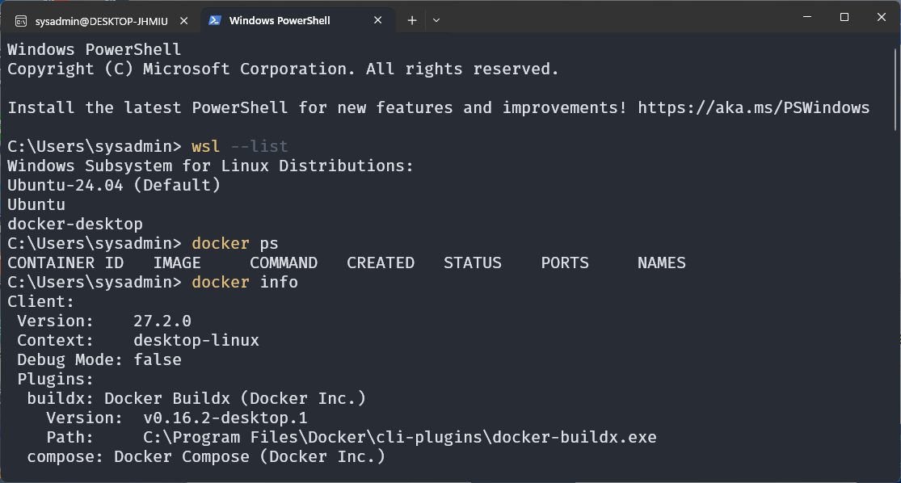

# install  WSL 2

## Enable HyperV
Open Turn Windows Features on or off


Open Power shell with Administor and run command  to Enable HyperV

```
Enable-WindowsOptionalFeature -Online -FeatureName Microsoft-Hyper-V-All
bcdedit /set hypervisorlaunchtype auto

Enable-WindowsOptionalFeature -Online -FeatureName Microsoft-Windows-Subsystem-Linux
```

## Install WSL
Open Power shell with Administrator

```
wsl --install
```


Test install ubuntu on wsl
```
wsl --set-default-version 2
wsl --list --online
wsl --install -d Ubuntu-24.04
wsl --list
```

## Install Docker Desktop
[https://docs.docker.com/desktop/install/windows-install/](https://docs.docker.com/desktop/install/windows-install/)


- Download ```Docker Desktop for window -x86_64```




Restart: Application if not automatice restart, We can click on icon on desktop



- skip






Check wsl 
```
> wsl --list
```


- Docker Desktop will connect to default docker-desktop linux in WSL

**Login to docker-desktop ```wsl -d docker-desktop```**
```
> wsl -d docker-desktop
```





- type Exit to exit from linux

# Install  another  Linux
Install ubuntu 24.04 
```
> wsl --install -d Ubuntu-24.04
```

- username: sysadmin
- Password: password

Welcome Screen, click skip on top right corner:


Complete Survey:


Docker Desktop Application:


During installation of Docker Desktop Application. Docker Desktop will install Ubuntu linux distro also

## check ip address of Linux ubuntu
```
> wsl hostname -I
172.20.255.117
```
- We will use this ip to connect service inside docker

**List Linux in wsl:**
- use command ```wsl --list``` to show Linux WSL distribution. Output will show below


- we see linux name **docker-desktop** which install belong to Docker-Desktop which have docker process run inside

- if we want to Change default WSL Distro, we can use command ```wsl --set-default```  `<name linux wsl>`. Example below


```
> wsl --set-default Ubuntu-24.04
```

## Understand WSL command to connect linux
- connect to Linux WSL distro use command ```wsl -d ```  `<name linux wsl>`. if we use command with out name it will connect to Default linux.
After connect already we will go linux shell (Bash) inside linux 

```
wsl 
wsl -d Ubuntu-24.04
```


- Congratuation. We inside linux already.
- use exit command to exit from linux


Test 2 Docker Command: to verify
- Open Windows Terminal and use docker command from windows (Remember)
```
> docker ps
> docker info
```



## Ip address of eth0 of every linux wsl same ip address

In Windows Subsystem for Linux (WSL 2), every installed Linux distribution shares the same network interface with the host Windows system. Therefore, **all WSL 2 distributions run on the same virtual network interface and use the same IP address**. This is different from WSL 1, where each distribution had its own IP address.

WSL 2 operates more like a virtual machine in terms of networking. Since all distributions share the same underlying virtualized network interface, they use the host's IP address for external communication.


## Benefits of WSL 2
To recap:

1. Virtual machines are resource intensive and create a very disconnected experience.
2. The original WSL was very connected, but had fairly poor performance compared to a VM.
3. WSL 2 brings a hybrid approach with a lightweight VM, a completely connected experience, and high performance.


Add in the WSL extension in Visual Studio Code and you have the best of all worlds – Linux and Windows compatibility for your tools with excellent performance and a seamless development experience


Connect to WSL 
- Connect to WSL  (default WSL distribution)
- Connect to WSL using Distro (Select WSL distribution)


Try to select WSL using Distro. VS code will list of WSL distribution


1. show connected WSL distribution
2. Click file explorer
3. Open Folder inside Linux WSL Distro 


## Connect to Linux WSL Distroy
- open Terminal in normal user 
```
wsl -d Ubuntu-24.04
```


- We will get Linux terminal 

## Open VScode Editor directly in Linux WSL 

```
> code .
```


